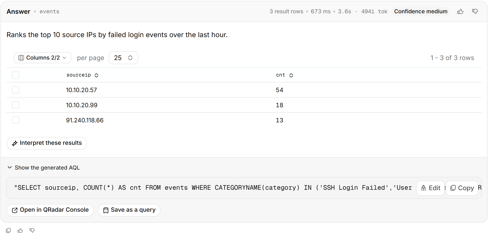
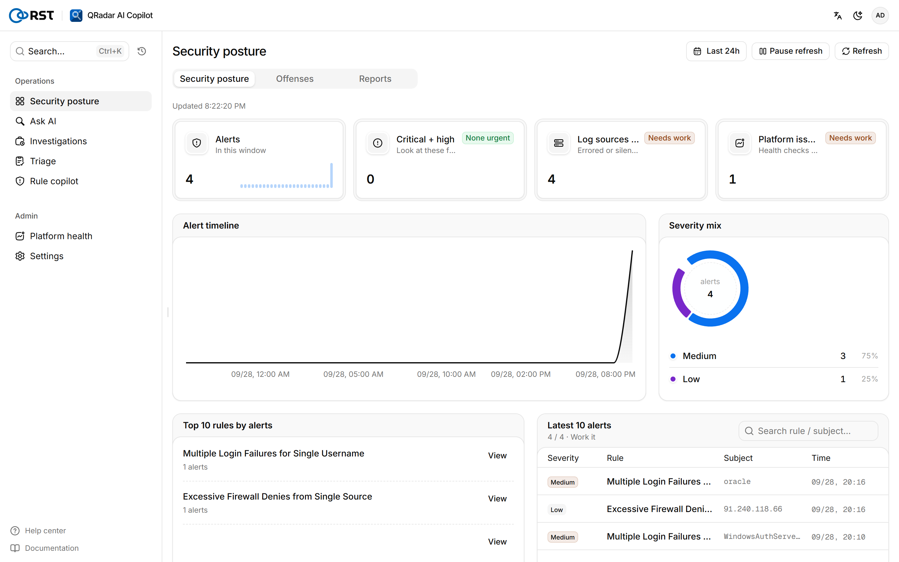
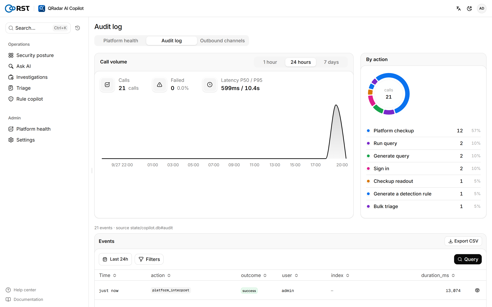
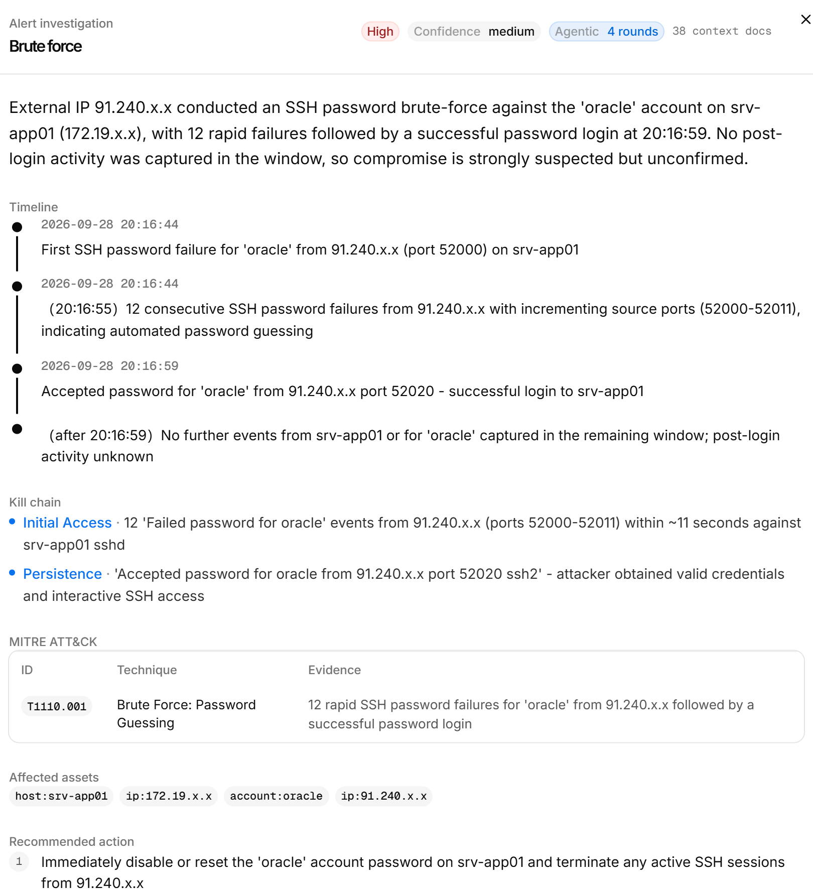
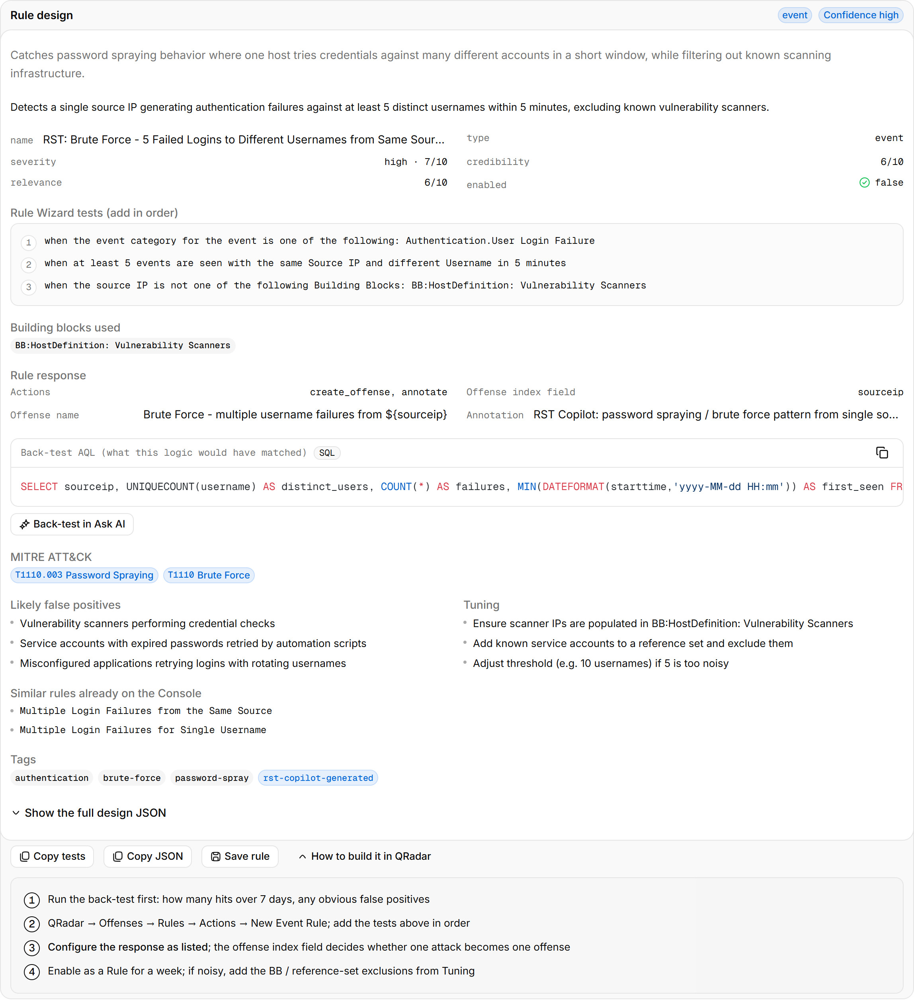
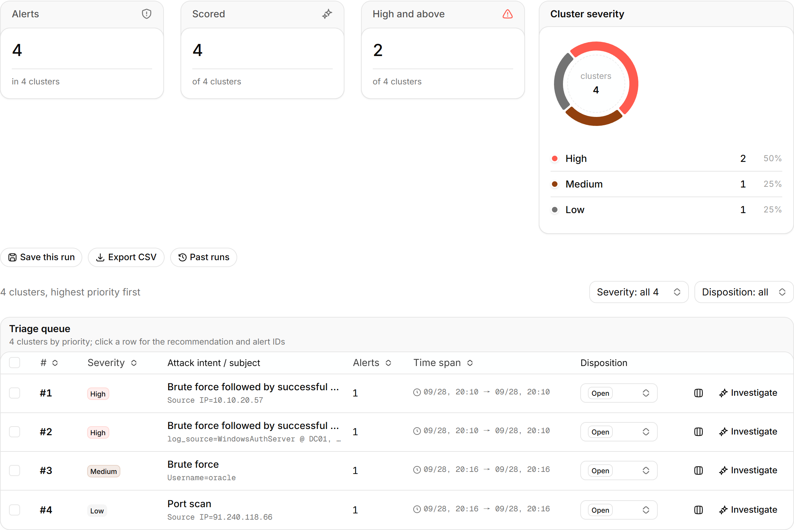
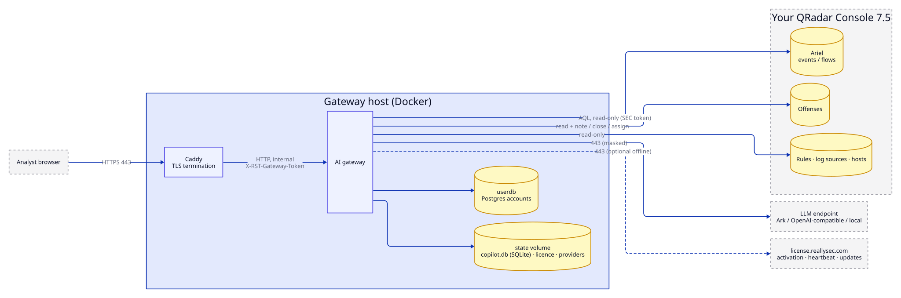

<p align="center">
  
</p>

<h1 align="center">RST QRadar AI Copilot</h1>

<p align="center">
  <b>Ask your QRadar in plain language.</b><br>
  A self-hosted AI copilot for security operations on the IBM QRadar you already run:<br>
  AQL search, offense triage and investigation, rule designs. Read-only, air-gap ready, every model call audited.
</p>

<p align="center">
  <a href="https://github.com/reallysec/RST-Qradar-AI-Copilot/releases"></a>
  
  
  
  <a href="https://reallysec.com/en/docs/qradar-ai-copilot"></a>
</p>

<p align="center">
  <b>English</b> · <a href="README.zh-CN.md">简体中文</a> · <a href="https://reallysec.com/en/docs/qradar-ai-copilot">Docs</a> · <a href="https://github.com/reallysec/RST-Qradar-AI-Copilot/releases">Download</a> · <a href="https://github.com/reallysec/RST-Qradar-AI-Copilot/issues">Report an issue</a>
</p>

<p align="center">
  
</p>

## Why RST QRadar AI Copilot

- **Works with the QRadar you have.** One Docker gateway next to your existing Console. No new data store, no agents; it reads events, flows, offenses, rules and log sources through an authorized-service token.
- **Read-only by design.** Every generated query is validated as a read-only AQL `SELECT` before it runs. The only writes to QRadar are three analyst-initiated offense actions: add a note, close, assign.
- **Your data stays in your network.** Field masking runs before anything reaches the model. Point it at Volcengine Ark, any OpenAI-compatible endpoint, or a local vLLM / Ollama for fully air-gapped operation.
- **Every step is accountable.** Each login, query, model call and settings change is an audit event you can search.

## Quick start

You need a Linux host with Docker Engine 24+ and Compose v2, network access to a QRadar 7.5+ Console on 443, an authorized-service token, an OpenAI-compatible LLM endpoint, and a hostname for the analysts ([full requirements](https://reallysec.com/en/docs/qradar-ai-copilot/install/requirements)).

Install with one command:

```bash
curl -fsSL https://github.com/reallysec/RST-Qradar-AI-Copilot/releases/latest/download/install.sh | sudo bash
```

The script downloads the latest bundle, checks its SHA-256, unpacks it into `/opt/rst-qradar-ai-copilot` and runs `deploy.sh`. There is one bundle for every edition: without a licence it runs as the free Community Edition, and importing a licence under **Settings → License** unlocks Professional or Enterprise in place. On an air-gapped host, run it elsewhere with `--download-only` and carry the bundle over.

Or download the bundle from [Releases](https://github.com/reallysec/RST-Qradar-AI-Copilot/releases) yourself:

```bash
sha256sum -c RST-Qradar-AI-Copilot-<version>.tar.gz.sha256
tar xzf RST-Qradar-AI-Copilot-<version>.tar.gz
cd RST-Qradar-AI-Copilot-<version> && ./deploy.sh
```

`deploy.sh` loads the images, generates secrets and the host fingerprint, asks for the LLM endpoint and the QRadar Console and token, and starts the stack behind Caddy TLS. About two minutes later, open `https://<hostname>/v2/`.

Upgrade, backup, SSO, the token's QRadar permissions and every `.env` key: [installation docs](https://reallysec.com/en/docs/qradar-ai-copilot/install/deploy).

## Features

Everything below is in the free Community Edition (one user, one node, no model-call limit; you bring your own model).

- **Smart query**: natural language to AQL, read-only `SELECT` validation, Ariel search lifecycle, result tables, multi-turn follow-ups, a deep link into the QRadar Console.
- **Offense feed**: offenses polled from `/api/siem/offenses`, an AI summary per offense, a live stream, dispositions, and close / note / assign written back to QRadar.
- **Posture**: security posture overview and a local audit trail.
- **Privacy controls**: log-source whitelist, field masking (cloud / private / air-gapped) and per-task reasoning levels.
- **Notifications**: Feishu, DingTalk, WeCom, Teams, Slack and email.

<table>
  <tr>
    <td width="50%"></td>
    <td width="50%"></td>
  </tr>
</table>

## Professional and Enterprise

Professional unlocks four AI engines: **offense batch triage**, **offense investigation** (agentic evidence gathering over `INOFFENSE()` events, timeline, MITRE ATT&CK, incident reports), a **rule copilot** (Rule Wizard tests, back-test AQL, duplicate check against live rules) and a **platform-ops copilot**, plus scheduled **operations reports** and more users (priced per user). Enterprise adds organisation-scale integration. Upgrading is a licence import on the same install: no reinstall, data and host fingerprint are kept. A 14-day trial covers every Enterprise feature on one host.

<table>
  <tr>
    <td width="50%"></td>
    <td width="50%"></td>
  </tr>
</table>

<details>
<summary><b>Compare editions</b></summary>

| | Community (free) | Professional | Enterprise |
|---|:---:|:---:|:---:|
| Everything under [Features](#features) | ✅ | ✅ | ✅ |
| Users | 1 | per seat | as quoted |
| **Offense batch triage**: cluster by rule and offense source, model-scored severity and false-positive verdicts | — | ✅ | ✅ |
| **Offense investigation**: agentic evidence gathering over `INOFFENSE()` events, timeline, MITRE ATT&CK, affected assets, actions, incident reports | — | ✅ | ✅ |
| **Rule copilot**: NL → Rule Wizard tests, response, back-test AQL, ATT&CK mapping, duplicate check against live rules | — | ✅ | ✅ |
| **Platform-ops copilot**: AI read of the deployment check-up (hosts, EPS licence, log-source health, offense backlog) | — | ✅ | ✅ |
| **Operations reports**: daily / weekly / monthly, scheduled delivery | — | ✅ | ✅ |
| Audit forwarding to an external SIEM (syslog / webhook, including back to QRadar) | — | — | ✅ |
| Multi-provider LLM failover / high availability | — | — | ✅ |
| OIDC single sign-on / enterprise identity | — | — | ✅ |
| Offline / air-gapped licence activation | — | — | ✅ |
| Nodes | 1 | 1 | unlimited |
| Model calls | unlimited | unlimited | unlimited |

Details and pricing: [licensing](https://reallysec.com/en/docs/qradar-ai-copilot/guide/license). Trials and licences: [console.reallysec.com](https://console.reallysec.com).

<p align="center">
  
</p>

</details>

## Architecture and data boundary

<p align="center">
  
</p>

- Ingress: the analyst browser on 443 only. Egress: the LLM endpoint, your QRadar Console, and `license.reallysec.com` (not needed with an offline licence, Enterprise).
- Read-only on QRadar apart from three analyst-initiated offense actions (note, close, assign). No rule, reference-data or configuration writes.
- The log-source whitelist bounds what the model may filter on, on top of the token's own security profile.
- Field masking runs before anything reaches the model; in air-gapped mode nothing leaves the network.
- Every login, query, model call and settings change is an audit event, forwardable to an external SIEM (including QRadar itself) in the Enterprise edition.

## Supported versions

| Component | Supported |
|---|---|
| IBM QRadar | 7.5 and later (REST API 20.0), verified on 7.6.0 FP1 Community Edition. 7.4 (API 16.0) has not been tested yet |
| LLM endpoint | Volcengine Ark, any OpenAI-compatible API, self-hosted vLLM / Ollama |
| Host | Linux with Docker Engine 24+ and Docker Compose v2 |

## Support

- **Questions and bugs**: open an [issue](https://github.com/reallysec/RST-Qradar-AI-Copilot/issues).
- **Security vulnerabilities**: do not open a public issue; follow the [security policy](https://github.com/reallysec/RST-Qradar-AI-Copilot/security/policy).

## Licensing

RST QRadar AI Copilot is proprietary software, distributed as compiled container images under the [End User License Agreement](LICENSE), also included in every bundle as `docs/EULA.md`. The Community Edition is free to use without a licence; Professional and Enterprise are activated online or with an offline `.lic` from [console.reallysec.com](https://console.reallysec.com). "RST", "Reallysec", "斯普朗克" and the product logos are trademarks.

© Anhui Reallysec Information Technology Ltd.
