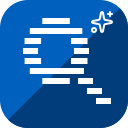
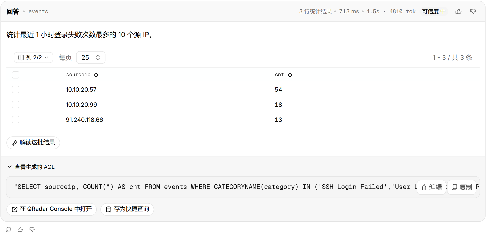
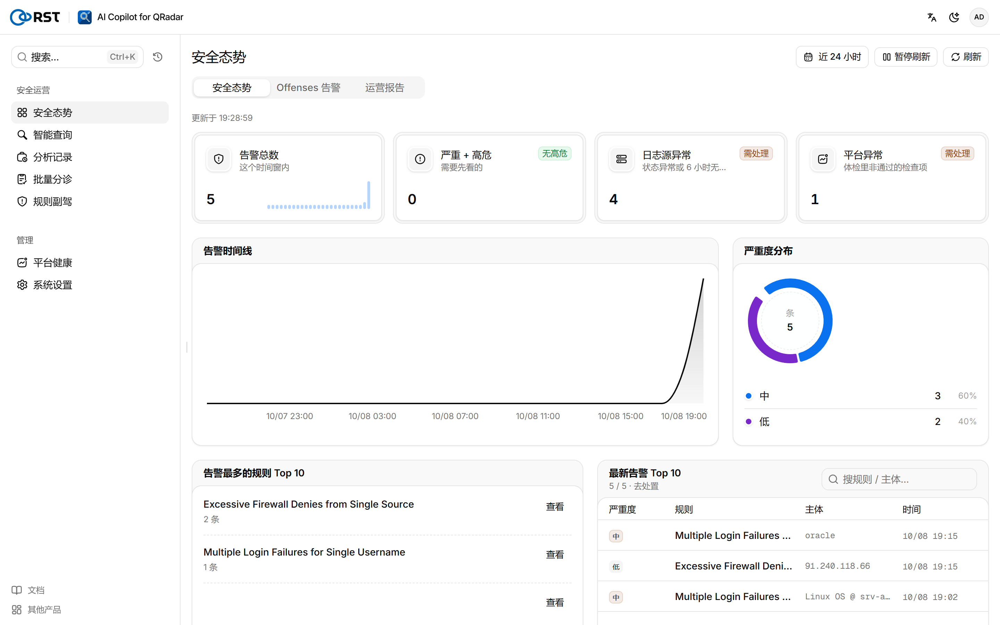
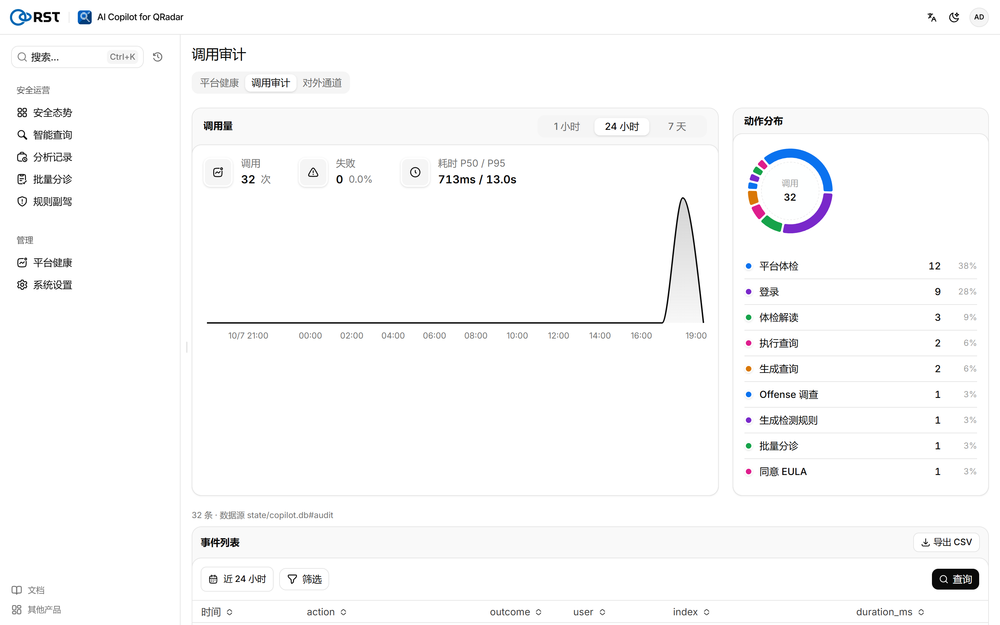
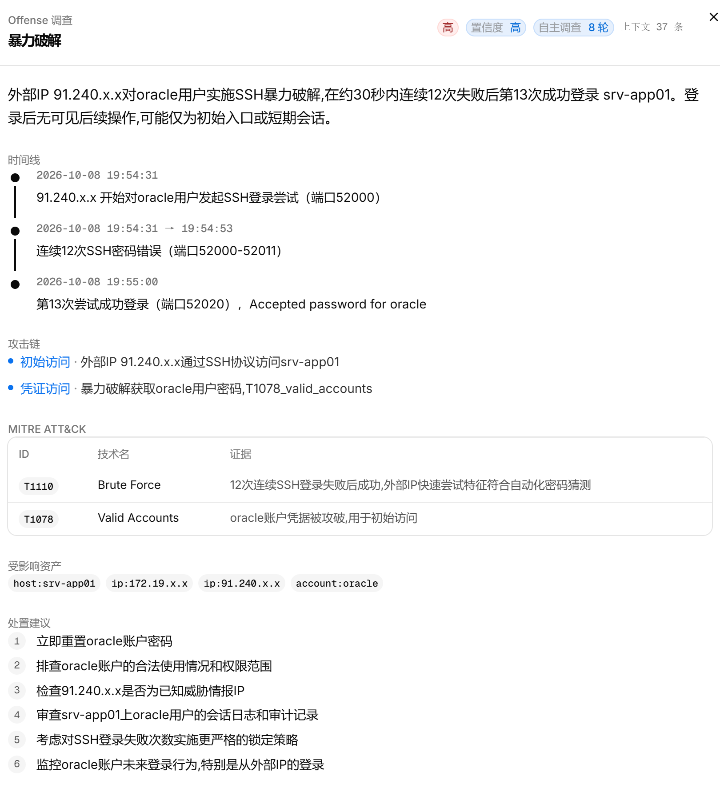
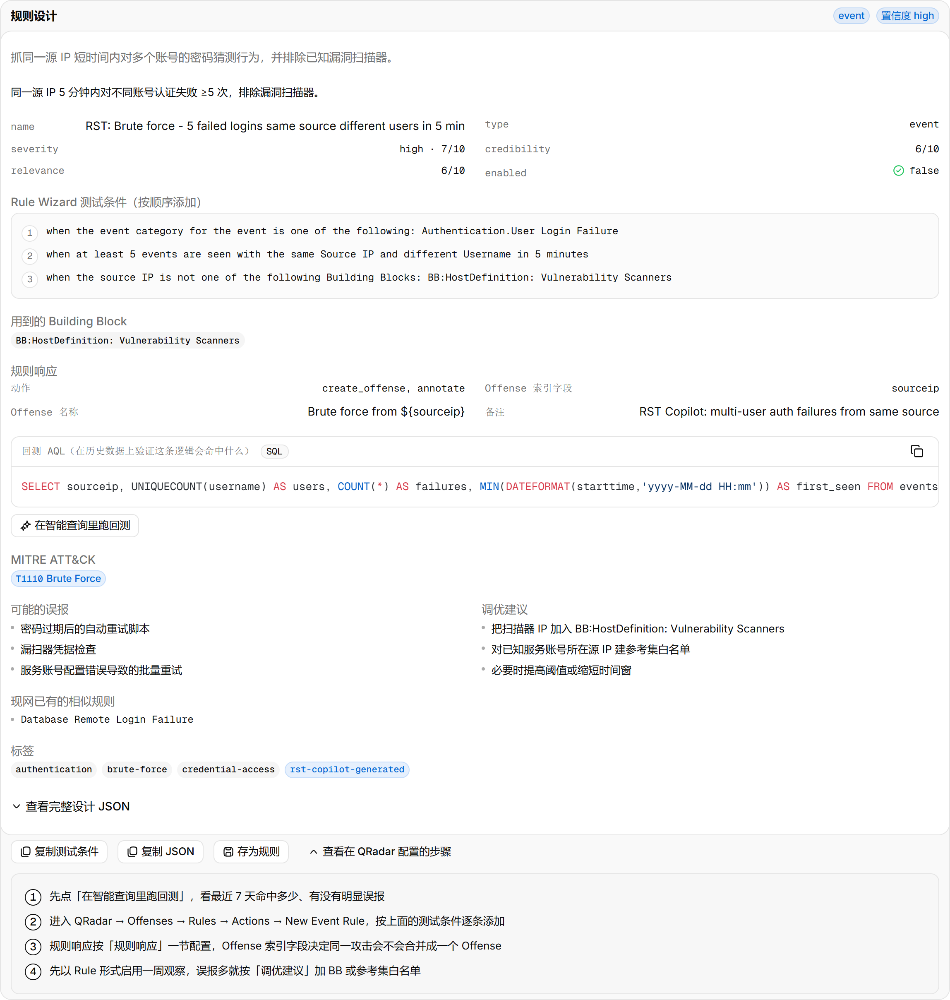
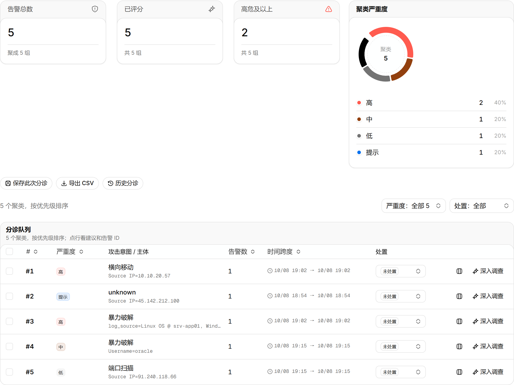
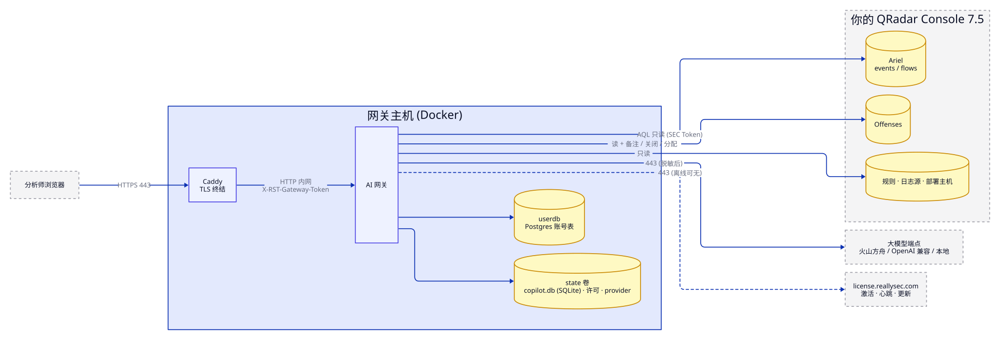

<p align="center">
  
</p>

<h1 align="center">RST QRadar AI Copilot</h1>

<p align="center">
  <b>用自然语言问你的 QRadar。</b><br>
  接在你已有的 IBM QRadar 上的私有化 AI 安全运营助手：<br>
  AQL 智能查询、Offense 研判与调查、规则设计。只读、可离线部署，每一次模型调用都有审计。
</p>

<p align="center">
  <a href="https://github.com/reallysec/RST-Qradar-AI-Copilot/releases"></a>
  
  
  
  <a href="https://reallysec.com/docs/qradar-ai-copilot"></a>
</p>

<p align="center">
  <a href="README.md">English</a> · <b>简体中文</b> · <a href="https://reallysec.com/docs/qradar-ai-copilot">文档</a> · <a href="https://github.com/reallysec/RST-Qradar-AI-Copilot/releases">下载</a> · <a href="https://github.com/reallysec/RST-Qradar-AI-Copilot/issues">提交问题</a>
</p>

<p align="center">
  
</p>

## 为什么选 RST QRadar AI Copilot

- **直接用你现有的 QRadar。** 一个 Docker 网关，接在已有的 Console 旁边。不新建数据存储、不装采集端，通过授权服务 Token 读取事件、流、Offense、规则和日志源。
- **设计上只读。** 每条生成的查询在执行前都校验为只读的 AQL `SELECT`。对 QRadar 唯一的写操作是分析师手动发起的三个 Offense 动作：加备注、关闭、指派。
- **数据留在你的网络里。** 字段脱敏在数据发给模型之前完成。大模型可以接火山方舟、任意 OpenAI 兼容端点，或自建 vLLM / Ollama 实现完全离线。
- **每一步都可追溯。** 每次登录、查询、模型调用、设置变更都是一条可检索的审计事件。

## 快速开始

需要一台 Linux 主机（Docker Engine 24+、Compose v2），能访问 QRadar 7.5+ Console 的 443 端口，一个授权服务 Token，一个 OpenAI 兼容的大模型端点，以及一个给分析师用的域名（[完整系统要求](https://reallysec.com/docs/qradar-ai-copilot/install/requirements)）。

一条命令安装：

```bash
curl -fsSL https://github.com/reallysec/RST-Qradar-AI-Copilot/releases/latest/download/install.sh | sudo bash
```

脚本下载最新的交付包，校验 SHA-256，解压到 `/opt/rst-qradar-ai-copilot` 后执行 `deploy.sh`。所有版本是同一个交付包：不导入许可即为免费的社区版，在「设置 → 许可」导入许可后原地解锁专业版或企业版。离线主机可以在有网的机器上加 `--download-only` 下载，再把交付包拷过去。

也可以从 [Releases](https://github.com/reallysec/RST-Qradar-AI-Copilot/releases) 手动下载交付包，然后：

```bash
sha256sum -c RST-Qradar-AI-Copilot-<版本>.tar.gz.sha256
tar xzf RST-Qradar-AI-Copilot-<版本>.tar.gz
cd RST-Qradar-AI-Copilot-<版本> && ./deploy.sh
```

`deploy.sh` 加载镜像、生成密钥和主机指纹、询问大模型端点和 QRadar Console 地址与 Token，然后在 Caddy TLS 后面起整个栈。约两分钟后打开 `https://<域名>/v2/`。

升级、备份、SSO、Token 需要的 QRadar 权限、全部 `.env` 项：[安装文档](https://reallysec.com/docs/qradar-ai-copilot/install/deploy)。

## 功能

以下能力全部包含在免费的社区版中（1 个用户、1 个节点，模型调用不限次数，模型由你自备）。

- **智能查询**：自然语言生成 AQL，只读 `SELECT` 校验、Ariel 检索全流程、结果表、多轮追问、一键跳转 QRadar Console。
- **Offense 流**：轮询 `/api/siem/offenses`，逐条 AI 摘要、实时推送、处置状态，关闭 / 备注 / 指派写回 QRadar。
- **安全态势**：态势总览、本地审计留痕。
- **隐私控制**：日志源白名单、字段脱敏三档（云端 / 私有 / 离线）、按任务分级的推理强度。
- **通知**：飞书、钉钉、企业微信、Teams、Slack、邮件。

<table>
  <tr>
    <td width="50%"></td>
    <td width="50%"></td>
  </tr>
</table>

## 专业版与企业版

专业版解锁四个 AI 引擎：**Offense 批量研判**、**Offense 调查**（基于 `INOFFENSE()` 事件自主取证、时间线、MITRE ATT&CK、事件报告）、**规则副驾**（Rule Wizard 测试项、回测 AQL、与现网规则查重）和**平台运维副驾**，另含定时**运营报表**和多用户（按用户计费）。企业版再加组织级集成。升级只需在原安装上导入许可，不用重装，数据与主机指纹保留。试用为 14 天企业版全功能，一台主机。

<table>
  <tr>
    <td width="50%"></td>
    <td width="50%"></td>
  </tr>
</table>

<details>
<summary><b>版本对比</b></summary>

| | 社区版（免费） | 专业版 | 企业版 |
|---|:---:|:---:|:---:|
| [功能](#功能)一节的全部能力 | ✅ | ✅ | ✅ |
| 用户数 | 1 | 按席位 | 按报价 |
| **Offense 批量研判**：按规则和 Offense 来源聚类，模型评级与误报判定 | — | ✅ | ✅ |
| **Offense 调查**：基于 `INOFFENSE()` 事件自主取证、时间线、MITRE ATT&CK、受影响资产、处置建议、事件报告 | — | ✅ | ✅ |
| **规则副驾**：自然语言生成 Rule Wizard 测试项、响应、回测 AQL、ATT&CK 映射、与现网规则查重 | — | ✅ | ✅ |
| **平台运维副驾**：部署体检（主机、EPS 许可、日志源健康、Offense 积压）的 AI 解读 | — | ✅ | ✅ |
| **运营报表**：日 / 周 / 月报，定时投递 | — | ✅ | ✅ |
| 审计转发到外部 SIEM（syslog / webhook，可回送 QRadar） | — | — | ✅ |
| 多 provider LLM 故障转移 / 高可用 | — | — | ✅ |
| OIDC 单点登录 / 企业身份 | — | — | ✅ |
| 离线许可激活 | — | — | ✅ |
| 节点数 | 1 | 1 | 不限 |
| 模型调用 | 不限 | 不限 | 不限 |

详情与价格见[许可说明](https://reallysec.com/docs/qradar-ai-copilot/guide/license)。试用与购买：[console.reallysec.com](https://console.reallysec.com)。

<p align="center">
  
</p>

</details>

## 架构与数据边界

<p align="center">
  
</p>

- 入站只有分析师浏览器的 443。出站：大模型端点、你的 QRadar Console、`license.reallysec.com`（使用离线许可时不需要，企业版）。
- 对 QRadar 只读，只有分析师手动发起的三个 Offense 动作（备注、关闭、指派）例外。不写规则、参考数据或配置。
- 日志源白名单在 Token 自身安全配置文件之外，再限定模型能过滤的范围。
- 字段脱敏在数据发给模型之前完成；离线模式不出网。
- 每次登录、查询、模型调用、设置变更都是一条审计事件，企业版可转发到外部 SIEM（包括 QRadar 自身）。

## 支持的版本

| 组件 | 支持情况 |
|---|---|
| IBM QRadar | 7.5 及以上（REST API 20.0），在 7.6.0 FP1 社区版上验证。7.4（API 16.0）尚未测试 |
| 大模型端点 | 火山方舟、任意 OpenAI 兼容 API、自建 vLLM / Ollama |
| 主机 | Linux，Docker Engine 24+ 与 Docker Compose v2 |

## 支持

- **使用问题和缺陷**：提交 [issue](https://github.com/reallysec/RST-Qradar-AI-Copilot/issues)。
- **安全漏洞**：请不要公开提 issue，按[安全策略](https://github.com/reallysec/RST-Qradar-AI-Copilot/security/policy)报告。

## 许可

RST QRadar AI Copilot 是专有软件，以编译后的容器镜像交付，依据[《最终用户许可协议》](LICENSE)使用（每个交付包里也附有 `docs/EULA.md`）。社区版无需许可、免费使用；专业版和企业版在 [console.reallysec.com](https://console.reallysec.com) 获取许可后在线激活或导入离线 `.lic`。「RST」「Reallysec」「斯普朗克」和产品标识是商标。

© 安徽斯普朗克信息技术有限公司（Anhui Reallysec Information Technology Ltd.）
